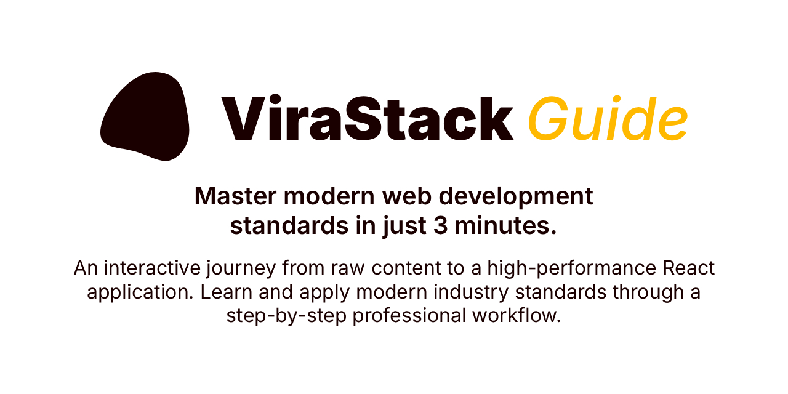

  

 

  
  
  
  
  

 

# Modern Web in 3 Minutes

An interactive, step-by-step journey demonstrating how modern web applications are built. From raw HTML to a fully styled, accessible, and AI-native experience using Next.js, Tailwind CSS 4, and shadcn/ui.

**[🚀 Start Interactive Guide](https://virastack.com/modern-web-in-3-minutes)**

## Explore the ViraStack Ecosystem

### Projects

- [**Next.js Boilerplate**](https://github.com/virastack/nextjs-boilerplate) - Production-ready Next.js 16+ starter template built with Tailwind CSS 4 and TypeScript.
- [**AI Rules**](https://github.com/virastack/ai-rules) - AI-native architecture kit and high-discipline protocols for modern React applications.
- [**Input Mask**](https://github.com/virastack/input-mask) - Lightweight, zero-dependency input masking library optimized for React Hook Form.
- [**Password Toggle**](https://github.com/virastack/password-toggle) - Fully accessible and highly customizable password visibility hook for React.
- [**Modern Web in 3 Minutes**](https://github.com/virastack/modern-web-in-3-minutes) - Master modern web development standards in just 3 minutes.

### 🚧 Coming Soon

- [**Start (CLI)**](https://github.com/virastack/cli) - Automated scaffolding tool to initialize and scale high-discipline ViraStack architectures.
- [**TanStack Boilerplate**](https://github.com/virastack/tanstack-boilerplate) - Production-ready TanStack Start starter template built with Tailwind CSS 4 and TypeScript.
- [**Standards**](https://github.com/virastack/standards) - A unified suite of ESLint, Prettier, and architectural rules to enforce absolute code integrity.
- [**Error Guard**](https://github.com/virastack/error-guard) - Pro-grade error handling and smart recovery protocols for zero-friction React environments.

... and more at [**virastack.com**](https://virastack.com)

## License

Licensed under the <a href="https://github.com/virastack/modern-web-in-3-minutes/blob/main/LICENSE">MIT License</a>.

## Maintainer

A project by [**Ömer Gülçiçek**](https://omergulcicek.com)

